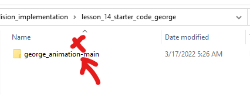
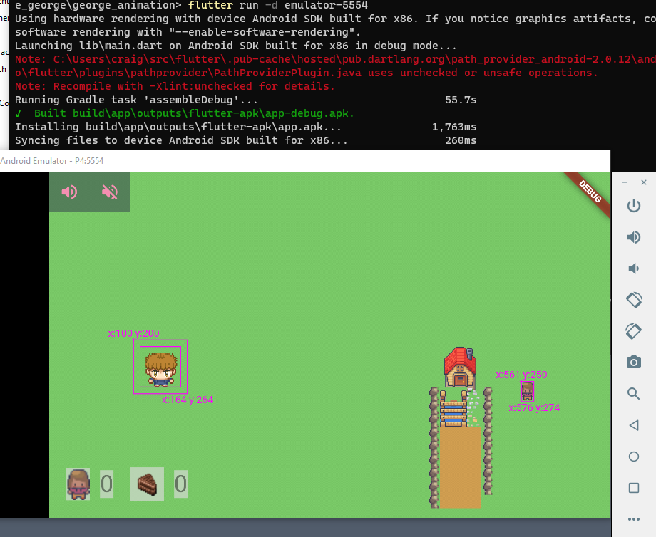

# George Flame

Tutorial to change animation in Flame.

## Running Code

If you downloaded the code as a zipped file, first extract the zipped folder, then rename the folder `george_animation-main` to eliminate the hyphen.

From the command line, in the directory with the `pubspec.yaml` 
file, run `flutter pub get`.

Start an Android Virtual Device (AVD).

In must cases, the Android emulator will have the name  `emulator-5554`.  

If this is the case, run `flutter -d emulator-5554`.

## Tutorials

* [Flame Animated Sprites Movement with Flutter - George 1](https://youtu.be/_PbvL1IO_e4)
* [Flame Animated Sprites Movement With Flutter  - George 2  - game background](https://youtu.be/kqluwfjI1sc)
* [Flutter overlay on Flame - George 3](https://youtu.be/2OADb-P01fA)
* [Flame background music - George 4](https://youtu.be/a8dWaCl3lKk)
* [Flame Sprite Collision with Tiled Object Bounding Boxes - George 5](https://youtu.be/o0QHxcwoJ3w)
* [Flutter Friend Overlay on Flame Game Screen - George 6]()
* [Tiled Object Layer for Flutter Flame Asset Placement and Collision - George 7](https://youtu.be/B34zIl87ekc)
* [Use Tiled Object Layer as SpriteComponents in Flutter Flame - George](https://youtu.be/yygYUDA3SUY)

## Credits

### Audio

* Applause - sfx https://freesound.org/people/timtube/sounds/169834/
* Yummy - sfx https://freesound.org/people/dorr1/sounds/338959/
* Music - bgm https://www.bensound.com/royalty-free-music/track/ukulele

### Graphics

* George (star character of our game): https://opengameart.org/content/alternate-lpc-character-sprites-george from user sheep Radomir Dopieralski
* Baked Goods:  https://ghostpixxells.itch.io/pixelfood
* Main tileset for map: https://limezu.itch.io/serenevillagerevamped - LimeZu
* Additional friend assets: https://limezu.itch.io/moderninteriors - LimeZu

## Learning Objections

* sprite character movement with change of animation
* overlay of Flutter widgets on top of FlameGame
* music with FlameAudio.bgm

