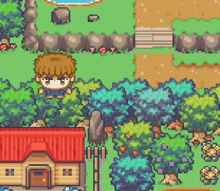

# George Flame

Tutorial to change animation in Flame.

## Tutorials

* [Flame Animated Sprites Movement with Flutter - George 1](https://youtu.be/_PbvL1IO_e4)
* [Flame Animated Sprites Movement With Flutter  - George 2  - game background](https://youtu.be/kqluwfjI1sc)
* [Flutter overlay on Flame - George 3](https://youtu.be/2OADb-P01fA)
* [Flame background music - George 4](https://youtu.be/a8dWaCl3lKk)
* [Flame Sprite Collision with Tiled Object Bounding Boxes - George 5](https://youtu.be/o0QHxcwoJ3w)
* [Flutter Friend Overlay on Flame Game Screen - George 6](https://youtu.be/qCm7JxT3eWI)
* [Tiled Object Layer for Flutter Flame Asset Placement and Collision - George 7](https://youtu.be/B34zIl87ekc)
* [Use Tiled Object Layer as SpriteComponents in Flutter Flame - George](https://youtu.be/yygYUDA3SUY)

## Learning Objections

* sprite character movement with change of animation
* overlay of Flutter widgets on top of FlameGame
* music with FlameAudio.bgm
* 